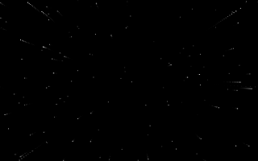
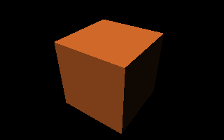
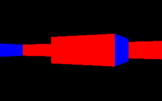
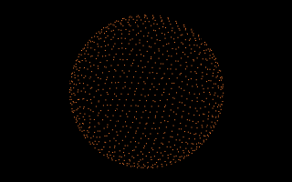
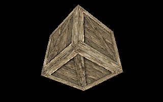

# Graphics

We were just reminiscing about staying up late reading "tutors" and creating awesome effects in QB45.

This is an attempt at recreating some of the long lost BAS files.

No longer can we just call interrupt 10h and poke at the 64000 bytes from a000h, and DOSBox is a bit much for kids these days.
But everyone has a browser, and JavaScript is alright.
So I've created a library of functions that allow us to setup a 320x200 canvas with 256 color palette and create all the classic effects.

The code is ES6 that runs directly in the browser so no complicated compiling or transpiling required.
I've tried to keep the code simple, just data and procedures.
There are JSDoc comments to give you and your text editor hints (may I suggest [Visual Studio Code](https://code.visualstudio.com/)).

Anyway, I'm having a lot of fun rereading all the tutors and recreating these effects.

## Run Online
 * https://bensmith87.github.io/graphics

## Run Locally
 1. Clone or download and unzip the repository
 2. Install the [Web Server for Chrome Extension](https://github.com/kzahel/web-server-chrome)
 3. Use the Web Server to serve the local copy of the repo
 4. Navigate to the URL provided (something like http://127.0.0.1:8887)

## Inspiration
You'll probably need to use the wayback machine to find these sites:
 * http://freespace.virgin.net/hugo.elias/
 * http://www.qbasicnews.com/tutorials.php
 * http://www.petesqbsite.com/sections/tutorials/graphics.shtml
 * https://www.cubic.org/
 * https://hacks.mozilla.org/2011/12/faster-canvas-pixel-manipulation-with-typed-arrays/
 * https://www.scratchapixel.com/lessons/3d-basic-rendering/introduction-to-shading/diffuse-lambertian-shading
 * https://www.davrous.com/2013/06/13/tutorial-series-learning-how-to-write-a-3d-soft-engine-from-scratch-in-c-typescript-or-javascript/

## Project Structure
There is a folder for each demo effect in some kind of chrono order.
Each demo has a html file (which is exactly the same) and a js file that contains all the fun code.

Any code that is reusable ends up in the lib folder.
